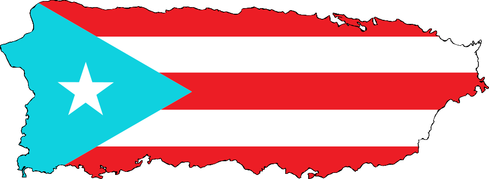

```{=html}
<style>
#title-block-header {
  display: none;
}

:root {
  --about-accent: #2563eb;
  --about-bg-secondary: var(--bs-tertiary-bg, #f5f5f4);
  --about-text-secondary: var(--bs-secondary-color, #57534e);
  --about-border: var(--bs-border-color, #e7e5e4);
}

body.quarto-dark {
  --about-bg-secondary: rgba(31, 41, 55, 0.92);
  --about-border: rgba(148, 163, 184, 0.28);
}

.about-shell {
  max-width: 100%;
  margin: 0 auto;
  padding: 3rem clamp(1rem, 2vw, 2rem) 5rem;
}

.about-hero {
  display: flex;
  align-items: center;
  gap: 1.5rem;
  margin-bottom: 2rem;
}

.about-avatar {
  width: 112px;
  height: 112px;
  border-radius: 999px;
  object-fit: cover;
  object-position: 50% 16%;
  flex-shrink: 0;
}

.about-kicker,
.about-section-heading {
  font-size: 0.75rem;
  font-weight: 700;
  text-transform: uppercase;
  letter-spacing: 0.12em;
}

.about-kicker {
  color: var(--about-accent);
  margin: 0 0 0.35rem;
}

.about-title {
  margin: 0;
  font-size: clamp(2rem, 3.5vw, 3rem);
  font-weight: 700;
  line-height: 1.05;
}

.about-bio {
  max-width: 50rem;
  margin-bottom: 2.5rem;
  color: var(--about-text-secondary);
  font-size: 1rem;
  line-height: 1.75;
}

.about-metrics {
  display: grid;
  grid-template-columns: repeat(4, minmax(0, 1fr));
  gap: 1rem;
  margin-bottom: 3rem;
}

.metric-card,
.origin-card,
.journey-link-card,
.community-card,
.hobbies-card {
  border: 1px solid var(--about-border);
  border-radius: 1.25rem;
  background: var(--about-bg-secondary);
}

.metric-card {
  padding: 1.25rem;
  text-align: center;
}

.metric-value {
  margin: 0 0 0.25rem;
  font-size: 2rem;
  font-weight: 700;
  line-height: 1;
}

.metric-label {
  margin: 0;
  color: var(--about-text-secondary);
  font-size: 0.82rem;
  line-height: 1.4;
}

.about-section-heading {
  color: var(--about-text-secondary);
  margin: 0 0 1rem;
}

.about-story-header {
  margin: 0 0 1.6rem;
}

.about-story-kicker {
  margin: 0 0 0.35rem;
  color: var(--about-accent);
  font-size: 0.74rem;
  font-weight: 700;
  letter-spacing: 0.12em;
  text-transform: uppercase;
}

.about-story-title {
  margin: 0 0 0.55rem;
  font-size: clamp(1.5rem, 2.3vw, 2rem);
  font-weight: 700;
  line-height: 1.1;
}

.about-story-copy {
  max-width: 50rem;
  margin: 0;
  color: var(--about-text-secondary);
  font-size: 0.98rem;
  line-height: 1.72;
}

.origin-card {
  display: flex;
  align-items: center;
  gap: 1.75rem;
  padding: 1.6rem;
  margin-bottom: 3rem;
}

.origin-flag-wrap {
  width: 14rem;
  flex-shrink: 0;
}

.origin-flag {
  width: 100%;
  border-radius: 1rem;
  display: block;
}

.origin-title,
.community-title,
.hobbies-title {
  margin: 0 0 0.5rem;
  font-size: 1.2rem;
  font-weight: 700;
}

.origin-copy,
.community-copy,
.hobbies-copy,
.section-link-copy {
  margin: 0;
  color: var(--about-text-secondary);
  font-size: 0.95rem;
  line-height: 1.7;
}

.hobbies-header {
  display: flex;
  align-items: center;
  justify-content: space-between;
  gap: 1rem;
  margin-bottom: 0.5rem;
}

.journey-link-card {
  display: flex;
  align-items: center;
  justify-content: space-between;
  gap: 1.25rem;
  padding: 1.5rem;
  margin-bottom: 3rem;
}

.journey-link-title {
  margin: 0 0 0.3rem;
  font-size: 1.15rem;
  font-weight: 700;
}

.journey-link-copy {
  margin: 0;
  color: var(--about-text-secondary);
  line-height: 1.65;
}

.journey-link-button,
.section-link-button {
  display: inline-flex;
  align-items: center;
  justify-content: center;
  padding: 0.85rem 1.15rem;
  border-radius: 0.9rem;
  background: var(--about-accent);
  color: #fff;
  font-weight: 600;
  text-decoration: none;
  white-space: nowrap;
}

.journey-link-button:hover,
.journey-link-button:focus,
.section-link-button:hover,
.section-link-button:focus {
  color: #fff;
  opacity: 0.92;
}

.community-card {
  display: grid;
  grid-template-columns: minmax(0, 1.1fr) minmax(24rem, 0.9fr);
  gap: 2rem;
  padding: 2rem;
  margin-bottom: 3rem;
}

.community-copy p {
  margin: 0 0 1rem;
}

.community-copy p:last-child {
  margin-bottom: 0;
}

.community-list {
  margin: 0 0 1.2rem;
  padding-left: 1.2rem;
  color: var(--about-text-secondary);
}

.community-list li + li {
  margin-top: 0.55rem;
}

.section-link-row {
  display: flex;
  align-items: center;
  justify-content: space-between;
  gap: 1rem;
  margin-top: 1.3rem;
  padding-top: 1.15rem;
  border-top: 1px solid var(--about-border);
}

.community-gallery {
  display: grid;
  grid-template-columns: minmax(0, 1.8fr) minmax(0, 1fr);
  gap: 0.85rem;
  align-items: start;
}

.community-figure {
  margin: 0;
}

.community-figure img {
  width: 100%;
  border-radius: 0.95rem;
  display: block;
}

.community-figure figcaption {
  margin-top: 0.45rem;
  color: var(--about-text-secondary);
  font-size: 0.8rem;
  line-height: 1.45;
  text-align: center;
}

.community-figure.small {
  display: flex;
  flex-direction: column;
}

.community-figure.small img {
  height: 100%;
  object-fit: contain;
  background: var(--bs-body-bg, #fff);
  padding: 0.45rem;
}

.lang-stack {
  display: flex;
  flex-direction: column;
  gap: 1rem;
  margin-bottom: 3rem;
}

.lang-bar-header {
  display: flex;
  justify-content: space-between;
  align-items: baseline;
  gap: 1rem;
  margin-bottom: 0.35rem;
}

.lang-name {
  font-size: 0.95rem;
  font-weight: 600;
}

.lang-level {
  color: var(--about-text-secondary);
  font-size: 0.82rem;
  text-align: right;
}

.lang-bar-track {
  height: 0.45rem;
  border-radius: 999px;
  background: rgba(127, 127, 127, 0.18);
  overflow: hidden;
}

.lang-bar-fill {
  width: 0;
  height: 100%;
  border-radius: 999px;
  background: var(--about-accent);
  transition: width 1s ease-out;
}

.hobbies-card {
  padding: 1.6rem;
}

.about-feature-panel,
.about-events-panel,
.about-hobbies-panel {
  border: 1px solid var(--about-border);
  border-radius: 1.25rem;
  background: var(--about-bg-secondary);
}

.about-feature-panel {
  padding: 1.75rem;
  margin-bottom: 3rem;
}

.about-feature-panel.about-feature-panel-collapsible:not(.is-expanded) {
  cursor: pointer;
}

.about-feature-panel.about-feature-panel-collapsible:not(.is-expanded):hover {
  border-color: color-mix(in srgb, var(--about-accent) 28%, var(--about-border));
}

.about-feature-summary {
  display: grid;
  grid-template-columns: minmax(0, 1.05fr) minmax(22rem, 0.95fr);
  gap: 1.75rem;
  align-items: start;
}

.about-feature-summary:focus-visible {
  outline: 2px solid color-mix(in srgb, var(--about-accent) 55%, transparent);
  outline-offset: 0.28rem;
  border-radius: 1rem;
}

.about-feature-title,
.about-events-title {
  margin: 0 0 0.55rem;
  font-size: 1.2rem;
  font-weight: 700;
}

.about-feature-subtitle {
  margin: 0 0 0.8rem;
  font-size: 1rem;
  font-weight: 700;
}

.about-feature-copy,
.about-event-copy,
.about-event-list,
.about-hobby-card p {
  color: var(--about-text-secondary);
  font-size: 0.95rem;
  line-height: 1.7;
}

.about-feature-copy p {
  margin: 0 0 1rem;
}

.about-feature-copy p:last-child {
  margin-bottom: 0;
}

.about-feature-points {
  margin: 0 0 1.2rem;
  padding-left: 1.2rem;
  color: var(--about-text-secondary);
}

.about-feature-points li + li {
  margin-top: 0.55rem;
}

.about-feature-gallery {
  display: grid;
  grid-template-columns: minmax(0, 1.7fr) minmax(0, 1fr);
  gap: 0.9rem;
  align-items: start;
}

.about-feature-figure {
  margin: 0;
}

.about-feature-figure img {
  width: 100%;
  height: 100%;
  display: block;
  border-radius: 1rem;
  object-fit: cover;
}

.about-feature-figure.contain img {
  object-fit: contain;
  height: auto;
  max-height: 10.75rem;
  background: var(--bs-body-bg, #fff);
  padding: 0.55rem;
}

.about-feature-figure figcaption {
  margin-top: 0.45rem;
  color: var(--about-text-secondary);
  font-size: 0.82rem;
  line-height: 1.45;
  text-align: center;
}

.about-feature-gallery-stack {
  display: flex;
  flex-direction: column;
  gap: 0.9rem;
  align-self: start;
}

.about-feature-moments {
  margin-top: 0.25rem;
  padding-top: 1.35rem;
  border-top: 1px solid var(--about-border);
  position: relative;
}

.about-feature-moments .about-events-shell {
  border: 1px solid var(--about-border);
  border-radius: 1rem;
  background: var(--about-bg-secondary);
  overflow: hidden;
}

.about-feature-panel.about-feature-panel-collapsible:not(.is-expanded) .about-feature-moments {
  max-height: 12.5rem;
  overflow: hidden;
}

.about-feature-panel.about-feature-panel-collapsible:not(.is-expanded) .about-events-scroll {
  max-height: none;
  overflow: hidden;
}

.about-feature-panel.about-feature-panel-collapsible:not(.is-expanded) .about-feature-moments::after {
  content: 'Click to Expand';
  position: absolute;
  right: 0;
  bottom: 0;
  left: 0;
  padding: 3.25rem 1rem 0.85rem;
  background: linear-gradient(180deg, rgba(255, 255, 255, 0) 0%, var(--about-bg-secondary) 68%);
  color: var(--about-accent);
  font-size: 0.72rem;
  font-weight: 700;
  letter-spacing: 0.06em;
  text-align: center;
  text-transform: uppercase;
  pointer-events: none;
}

.about-events-panel {
  padding: 0;
  overflow: hidden;
  margin-bottom: 3rem;
}

.about-events-shell {
  display: grid;
  grid-template-columns: 15rem minmax(0, 1fr);
}

.about-events-intro {
  padding: 1.6rem;
  border-right: 1px solid var(--about-border);
}

.about-events-intro p:last-child {
  margin-bottom: 0;
}

.about-events-scroll {
  max-height: 34rem;
  overflow-y: auto;
  padding: 1.25rem;
}

.about-season-block + .about-season-block {
  margin-top: 1.25rem;
}

.about-season-header {
  margin-bottom: 0.85rem;
}

.about-event-card {
  padding: 1.05rem;
  border-radius: 1rem;
  border: 1px solid var(--about-border);
  background: var(--bs-body-bg, #fff);
}

.about-event-card + .about-event-card {
  margin-top: 0.8rem;
}

.about-event-season {
  margin: 0 0 0.35rem;
  color: var(--about-accent);
  font-size: 0.8rem;
  font-weight: 700;
  letter-spacing: 0.05em;
  text-transform: uppercase;
}

.about-event-title {
  margin: 0 0 0.55rem;
  font-size: 1rem;
  font-weight: 700;
}

.about-event-copy {
  margin: 0 0 0.8rem;
}

.about-event-list {
  margin: 0;
  padding-left: 1.1rem;
}

.about-event-list li + li {
  margin-top: 0.45rem;
}

.about-hobbies-panel {
  padding: 1.6rem;
}

.about-hobbies-grid {
  display: grid;
  grid-template-columns: repeat(4, minmax(0, 1fr));
  gap: 1rem;
  margin-top: 1.25rem;
}

.about-hobby-card {
  padding: 1.15rem;
  border-radius: 1rem;
  border: 1px solid var(--about-border);
  background: var(--bs-body-bg, #fff);
}

.about-hobby-card-title {
  margin: 0 0 0.45rem;
  font-size: 1rem;
  font-weight: 700;
}

.about-interest-tags {
  display: flex;
  flex-wrap: wrap;
  gap: 0.75rem;
  margin-top: 1.15rem;
}

.interests-grid {
  display: flex;
  flex-wrap: wrap;
  gap: 0.75rem;
  margin-top: 1rem;
}

.interest-tag {
  padding: 0.55rem 1rem;
  border-radius: 999px;
  border: 1px solid var(--about-border);
  color: var(--about-text-secondary);
  font-size: 0.9rem;
  font-weight: 500;
  background: transparent;
}

body.quarto-dark .metric-value,
body.quarto-dark .about-story-title,
body.quarto-dark .origin-title,
body.quarto-dark .journey-link-title,
body.quarto-dark .community-title,
body.quarto-dark .hobbies-title,
body.quarto-dark .about-feature-title,
body.quarto-dark .about-feature-subtitle,
body.quarto-dark .about-events-title,
body.quarto-dark .about-event-title,
body.quarto-dark .about-hobby-card-title,
body.quarto-dark .lang-name {
  color: var(--bs-body-color);
}

body.quarto-dark .about-bio,
body.quarto-dark .about-story-copy,
body.quarto-dark .metric-label,
body.quarto-dark .about-section-heading,
body.quarto-dark .origin-copy,
body.quarto-dark .community-copy,
body.quarto-dark .hobbies-copy,
body.quarto-dark .about-feature-copy,
body.quarto-dark .about-feature-points,
body.quarto-dark .about-feature-figure figcaption,
body.quarto-dark .about-event-copy,
body.quarto-dark .about-event-list,
body.quarto-dark .about-hobby-card p,
body.quarto-dark .section-link-copy,
body.quarto-dark .journey-link-copy,
body.quarto-dark .community-list,
body.quarto-dark .community-figure figcaption,
body.quarto-dark .lang-level,
body.quarto-dark .interest-tag {
  color: rgba(226, 232, 240, 0.84);
}

body.quarto-dark .community-figure.small img,
body.quarto-dark .about-feature-figure.contain img,
body.quarto-dark .about-hobby-card,
body.quarto-dark .interest-tag {
  background: rgba(15, 23, 42, 0.72);
}

body.quarto-dark .about-feature-panel.about-feature-panel-collapsible:not(.is-expanded) .about-feature-moments::after {
  background: linear-gradient(180deg, rgba(15, 23, 42, 0) 0%, var(--about-bg-secondary) 68%);
}

@media (max-width: 980px) {
  .about-metrics {
    grid-template-columns: repeat(2, minmax(0, 1fr));
  }

  .about-feature-summary,
  .about-hobbies-grid,
  .journey-link-card,
  .community-card {
    grid-template-columns: 1fr;
  }

  .about-events-shell {
    grid-template-columns: 1fr;
  }

  .about-events-intro {
    border-right: none;
    border-bottom: 1px solid var(--about-border);
  }

  .about-events-scroll {
    max-height: none;
  }

  .journey-link-card,
  .section-link-row,
  .hobbies-header {
    flex-direction: column;
    align-items: flex-start;
  }
}

@media (max-width: 640px) {
  .about-shell {
    padding: 2.5rem 1rem 4rem;
  }

  .about-hero,
  .origin-card {
    flex-direction: column;
    align-items: flex-start;
  }

  .origin-flag-wrap,
  .community-gallery {
    width: 100%;
  }

  .about-metrics {
    grid-template-columns: 1fr;
  }

  .community-gallery {
    grid-template-columns: 1fr;
  }

  .about-feature-gallery {
    grid-template-columns: 1fr;
  }

  .lang-bar-header {
    flex-direction: column;
    align-items: flex-start;
    gap: 0.15rem;
  }

  .lang-level {
    text-align: left;
  }
}
</style>

<!-- Intro -->
<div class="about-shell">
  <div class="about-hero">
    <!--  -->
    <div>
      <p class="about-kicker">About</p>
      <p class="about-title">A Little About Me.</p>
    </div>
  </div>

  <div class="about-bio">
    <p>
      Armed with my Bachelors Degree in Electrical Engineering and a certificate in unmanned vehicle systems, I decided to make the jump from the DFW to Atlanta to pursue my Ph.D in Robotics. Rather than getting a Masters, I am instead the not-sure-if-I'm-proud owner of 2 undergraduate minor degrees and 1 doctoral minor degree.
    </p>
  </div>

  <!-- 4 Languages, 4 Locations, etc Section -->
  <div class="about-metrics">
    <div class="metric-card">
      <p class="metric-value">4</p>
      <p class="metric-label">Languages</p>
    </div>
    <div class="metric-card">
      <p class="metric-value">4</p>
      <p class="metric-label">Locations</p>
    </div>
    <div class="metric-card">
      <p class="metric-value">4</p>
      <p class="metric-label">Research labs along the way</p>
    </div>
    <div class="metric-card">
      <p class="metric-value">1</p>
      <p class="metric-label">Community organization founded</p>
    </div>
  </div>


  <!-- ``Where I'm From'' Section -->
  <p class="about-section-heading">Where I'm From</p>
  <div class="origin-card">
    <div class="origin-flag-wrap">
      
    </div>
    <div>
      <p class="origin-title">Puerto Rico</p>
      <p class="origin-copy">
        My cultural roots shaped my values, my drive, and my sense of community.
      </p>
    </div>
  </div>

  <!-- Languages Section -->
  <p class="about-section-heading">Languages</p>
  <div class="lang-stack" id="lang-bars">
    <div class="lang-bar-container">
      <div class="lang-bar-header">
        <span class="lang-name">Spanish</span>
        <span class="lang-level">Native</span>
      </div>
      <div class="lang-bar-track">
        <div class="lang-bar-fill" data-pct="100"></div>
      </div>
    </div>
    <div class="lang-bar-container">
      <div class="lang-bar-header">
        <span class="lang-name">English</span>
        <span class="lang-level">Native</span>
      </div>
      <div class="lang-bar-track">
        <div class="lang-bar-fill" data-pct="100"></div>
      </div>
    </div>
    <div class="lang-bar-container">
      <div class="lang-bar-header">
        <span class="lang-name">French</span>
        <span class="lang-level">Semi-conversational</span>
      </div>
      <div class="lang-bar-track">
        <div class="lang-bar-fill" data-pct="45"></div>
      </div>
    </div>
    <div class="lang-bar-container">
      <div class="lang-bar-header">
        <span class="lang-name">Portuguese</span>
        <span class="lang-level">Reading proficiency; speaking fluency in progress</span>
      </div>
      <div class="lang-bar-track">
        <div class="lang-bar-fill" data-pct="30"></div>
      </div>
    </div>
  </div>

  <!-- <p class="about-section-heading">Community</p>
  <div class="community-card">
    <div class="community-copy">
      <p class="community-title">BORI</p>
      <p>
        I helped co-found <strong>BORI (Boricuas Organized for Impact)</strong> to build community and celebrate Puerto Rican culture at Georgia Tech. It has become one of the main ways I stay connected to home while also making campus feel more welcoming for other Puerto Rican students.
      </p>
      <ul class="community-list">
        <li>We create spaces that feel culturally familiar. From bringing our traditional celebrations to Atlanta, to game and movie nights with Puerto Rican food.</li>
        <li>We try to be useful, not just social, helping newer students find people, resources, and a sense of belonging.</li> -->
        <!-- <li>The organization reflects a part of me that matters just as much as the research: building community that lasts.</li> -->
        <!-- <a class="section-link-button" href="../community/">See Community &amp; Hobbies</a> -->
      <!-- </ul> -->
      <!-- <div class="section-link-row"> -->
        <!-- <p class="section-link-copy"> -->
          <!-- The longer version, including BORI events and the non-research side, lives on the standalone page. -->
        <!-- </p> -->
      <!-- </div> -->
    <!-- </div> -->
    <!-- <div class="community-gallery"> -->
      <!-- <figure class="community-figure"> -->
        <!-- 
        <figcaption>BORI co-founders, left to right: Gustavo, Camelia, Evanns</figcaption>
      </figure>
      <figure class="community-figure small">
        
        <figcaption>The BORI mascot: Coquí with Coquito</figcaption>
      </figure>
    </div> -->
  <!-- </div> -->

  <div class="about-story-header">
    <p class="about-story-kicker">Beyond Research</p>
    <p class="about-story-title">Community &amp; Hobbies</p>
    <p class="about-story-copy">
      The part of the story that is not just papers and control theory.
    </p>
  </div>

  <p class="about-section-heading">Community</p>
  <section class="about-feature-panel about-feature-panel-collapsible" id="about-bori-panel">
    <div class="about-feature-summary" role="button" tabindex="0" aria-expanded="false" aria-controls="about-bori-moments">
      <div class="about-feature-copy">
        <p class="about-feature-title">BORI at Georgia Tech</p>
        <p>
          I co-founded <strong>BORI (Boricuas Organized for Impact)</strong> to make sure Puerto Rican students at Georgia Tech had a space that felt familiar, welcoming, and (hopefully) professionally useful.
        </p>
        <ul class="about-feature-points">
          <li>We build events around culture, food, and <del>fun</del> ...professional development</li>
          <li>We host events focused on making new students feel comfortable in Atlanta and Georgia Tech.</li>
          <li>BORI also helped me keep up with the latest slang since I left the island and no longer feel so distant from the culture I grew up with.</li>
        </ul>
        <!-- <p>
          That side of my life matters for the same reason the research does: both are about building systems that people can trust.
        </p> -->
      </div>
      <div class="about-feature-gallery">
        <figure class="about-feature-figure">
          
          <figcaption>BORI co-founders, left to right: Gustavo, Camelia, Evanns</figcaption>
        </figure>
        <div class="about-feature-gallery-stack">
          <figure class="about-feature-figure contain">
            
            <figcaption>The BORI logo</figcaption>
          </figure>
          <figure class="about-feature-figure contain">
            
            <figcaption>The BORI mascot: Coquí with Coquito</figcaption>
          </figure>
        </div>
      </div>
    </div>
    <div class="about-feature-moments" id="about-bori-moments">
      <p class="about-feature-subtitle">BORI Moments</p>
      <div class="about-events-shell">
        <div class="about-events-intro">
          <p class="about-events-title">Event history</p>
          <p class="about-event-copy">
            I&apos;ll update these with pictures and videos as well coming up soon &#128578
          </p>
        </div>
        <div class="about-events-scroll">
          <div class="about-season-block">
            <div class="about-season-header">
              <p class="about-event-season">Fall 2024</p>
            </div>

            <article class="about-event-card">
              <p class="about-event-title">Inaugural BORI Event</p>
              <ul class="about-event-list">
                <li>Homemade coquito, sandwiches de mezclita, sorullitos.</li>
                <li>Introduced everyone to the club and its purpose and vision.</li>
              </ul>
            </article>

            <article class="about-event-card">
              <p class="about-event-title">Trivia Night with Snacks</p>
              <ul class="about-event-list">
                <li>Puerto Rico trivia questions.</li>
                <li>Snacks and a lower-pressure social setting.</li>
              </ul>
            </article>
          </div>

          <div class="about-season-block">
            <div class="about-season-header">
              <p class="about-event-season">Spring 2025</p>
            </div>

            <article class="about-event-card">
              <p class="about-event-title">Winter Org Fair · Enero 30 · 11am-1pm</p>
              <ul class="about-event-list">
                <li>Poster, banderitas, bocina, Hershey Kisses.</li>
              </ul>
            </article>

            <article class="about-event-card">
              <p class="about-event-title">BORI Kickoff · Febrero 6 · 5pm</p>
              <ul class="about-event-list">
                <li>Coquito, sandwiches de mezclita, sorullitos.</li>
              </ul>
            </article>

            <article class="about-event-card">
              <p class="about-event-title">Festival de Chocolate · Febrero 21</p>
              <ul class="about-event-list">
                <li>Fresas con chocolate, tierrita, start-stop running game, papa caliente.</li>
                <li>The Standard rooftop area.</li>
              </ul>
            </article>

            <article class="about-event-card">
              <p class="about-event-title">March Gladness · Marzo 6</p>
              <ul class="about-event-list">
                <li>Tabling event with a traditional Puerto Rican jacks game.</li>
              </ul>
            </article>

            <article class="about-event-card">
              <p class="about-event-title">BORI Game Night · Marzo 13</p>
              <ul class="about-event-list">
                <li>Traditional Puerto Rican games and Puerto Rico-themed games.</li>
                <li>Snacks.</li>
              </ul>
            </article>
          </div>

          <div class="about-season-block">
            <div class="about-season-header">
              <p class="about-event-season">Fall 2025</p>
            </div>

            <article class="about-event-card">
              <p class="about-event-title">Freshman Kickoff · Agosto 12 · 1:15pm · Skiles 169</p>
              <ul class="about-event-list">
                <li>Bienvenidos a GT and Atlanta, with an emphasis on being a resource for new students from Puerto Rico.</li>
                <li>Krispy Kreme donuts.</li>
              </ul>
            </article>

            <article class="about-event-card">
              <p class="about-event-title">Fall Org Fair · Agosto 27 · 11am-1pm · Tech Green</p>
              <ul class="about-event-list">
                <li>Poster, banderitas, bocina, Hershey Kisses.</li>
              </ul>
            </article>

            <article class="about-event-card">
              <p class="about-event-title">BORI KickOff · Septiembre 3 · 5:30pm · Boggs 103</p>
              <ul class="about-event-list">
                <li>Publix cookies, snacks tipicos, dulcecitos.</li>
              </ul>
            </article>

            <article class="about-event-card">
              <p class="about-event-title">BORI Professional Panel · Septiembre 24 · 5pm · IC Building</p>
              <ul class="about-event-list">
                <li>Prepared questions and participant gifts.</li>
              </ul>
            </article>

            <article class="about-event-card">
              <p class="about-event-title">Dominos Tournament · Octubre · 11am-1pm · Kendeda Building</p>
              <ul class="about-event-list">
                <li>Funding request for $200.</li>
                <li>Dominoes, Papi&apos;s Cuban catered empanadas, prizes.</li>
              </ul>
            </article>

            <article class="about-event-card">
              <p class="about-event-title">Vamo a Jugal&apos; · Octubre 10 · 4pm · Piedmont Park</p>
              <ul class="about-event-list">
                <li>Limber de parcha, cherry, and coco.</li>
                <li>Soccer, volleyball, football, and a bocina for an active outdoor event.</li>
              </ul>
            </article>

            <article class="about-event-card">
              <p class="about-event-title">Movie Night · Noviembre 13 · 7pm · The Connector Apt</p>
              <ul class="about-event-list">
                <li>Reserved the big screen on the 7th floor.</li>
                <li>Puerto Rican film, popcorn, snacks.</li>
              </ul>
            </article>

            <article class="about-event-card">
              <p class="about-event-title">Taller Coquito · Noviembre · 7pm · The Standard Apt</p>
              <ul class="about-event-list">
                <li>Leche evaporada, leche condensada, crema de coco, canela molida, vainilla.</li>
                <li>Glass bottles so people could take home the coquito they made.</li>
              </ul>
            </article>
          </div>

          <div class="about-season-block">
            <div class="about-season-header">
              <p class="about-event-season">Spring 2026</p>
            </div>

            <article class="about-event-card">
              <p class="about-event-title">Resume Review Workshop · Enero 22, 2026 · Crossland 2157</p>
              <ul class="about-event-list">
                <li>Professional-development event focused on strengthening resumes and preparing members for internship and full-time applications.</li>
              </ul>
            </article>

            <article class="about-event-card">
              <p class="about-event-title">Cafezinho com Brasa · Enero 29, 2026 · The Connector 7th Floor</p>
              <ul class="about-event-list">
                <li>Joint social event with the Brazilian student organization to socialize and taste-test coffees from each other&apos;s countries.</li>
              </ul>
            </article>

            <article class="about-event-card">
              <p class="about-event-title">Joint General Body Meeting with ALPFA and Cisco · Febrero 3, 2026 · Scheller 300</p>
              <ul class="about-event-list">
                <li>Collaborative event with ALPFA where we hosted recruiters from Cisco.</li>
              </ul>
            </article>

            <article class="about-event-card">
              <p class="about-event-title">World Baseball Classic Watch Party · Marzo 6, 2026 · Inspire Apt</p>
              <ul class="about-event-list">
                <li>Watched Team Puerto Rico take on Colombia together and turned it into a community hangout around baseball and home-team energy.</li>
              </ul>
            </article>
          </div>
        </div>
      </div>
    </div>
  </section>

  <p class="about-section-heading">Hobbies</p>
  <section class="about-hobbies-panel">
    <p class="hobbies-title">Do Ph.D Students Have Lives?</p>
    <p class="hobbies-copy">
      When I'm not exercising my weak brain muscles I try to work out my other muscles, mainly so I can afford to indulge in my main hobby of cooking. When an find the time and discipline, I also love practicing my salsa technique at my dance studio and out at socials, as well as reading books about history, psychology and, recently, memoirs.
    </p>

    <div class="about-hobbies-grid">
      <article class="about-hobby-card">
        <p class="about-hobby-card-title">Fitness</p>
        <p>To lift or not to lift, that is the question.</p>
      </article>
      <article class="about-hobby-card">
        <p class="about-hobby-card-title">Cooking</p>
        <p>I'm my own private chef. And my client has exotic taste.</p>
      </article>
      <article class="about-hobby-card">
        <p class="about-hobby-card-title">Dance</p>
        <p>Meh I'm getting better.</p>
      </article>
      <article class="about-hobby-card">
        <p class="about-hobby-card-title">Reading</p>
        <p>I do eventually finish books I start after the fifth time I try reading them.</p>
      </article>
    </div>

    <!-- <div class="about-interest-tags">
      <span class="interest-tag">Fitness</span>
      <span class="interest-tag">Cooking</span>
      <span class="interest-tag">Dance</span>
      <span class="interest-tag">Reading</span>
      <span class="interest-tag">Writing</span>
      <span class="interest-tag">Film</span>
      <span class="interest-tag">Community Building</span>
    </div> -->

  </section>
</div>

<script>
document.addEventListener('DOMContentLoaded', function () {
  var bars = document.querySelectorAll('.lang-bar-fill');
  var boriPanel = document.getElementById('about-bori-panel');
  var boriSummary = document.querySelector('.about-feature-summary');
  var boriMoments = document.getElementById('about-bori-moments');

  function setBoriExpanded(isExpanded) {
    if (!boriSummary || !boriMoments || !boriPanel) return;
    boriSummary.setAttribute('aria-expanded', String(isExpanded));
    boriPanel.classList.toggle('is-expanded', isExpanded);
  }

  if (boriPanel && boriSummary && boriMoments) {
    setBoriExpanded(false);

    boriSummary.addEventListener('keydown', function (event) {
      if (event.key !== 'Enter' && event.key !== ' ') return;
      event.preventDefault();
      setBoriExpanded(!boriPanel.classList.contains('is-expanded'));
    });

    boriPanel.addEventListener('click', function (event) {
      var clickedSummary = event.target.closest('.about-feature-summary');

      if (!boriPanel.classList.contains('is-expanded')) {
        setBoriExpanded(true);
        return;
      }

      if (clickedSummary) {
        setBoriExpanded(false);
      }
    });
  }

  if (bars.length) {
    var observer = new IntersectionObserver(function (entries) {
      entries.forEach(function (entry) {
        if (entry.isIntersecting) {
          entry.target.style.width = entry.target.getAttribute('data-pct') + '%';
          observer.unobserve(entry.target);
        }
      });
    }, { threshold: 0.3 });

    bars.forEach(function (bar) {
      observer.observe(bar);
    });
  }
});
</script>
```
