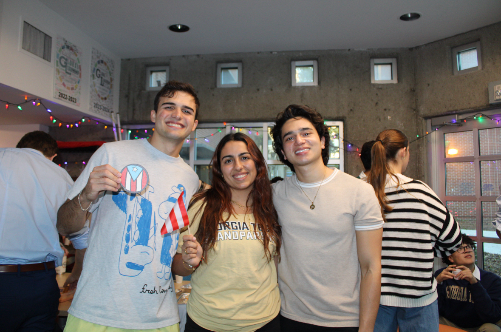
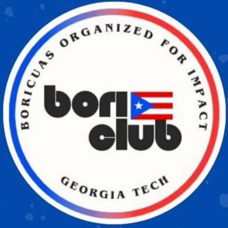
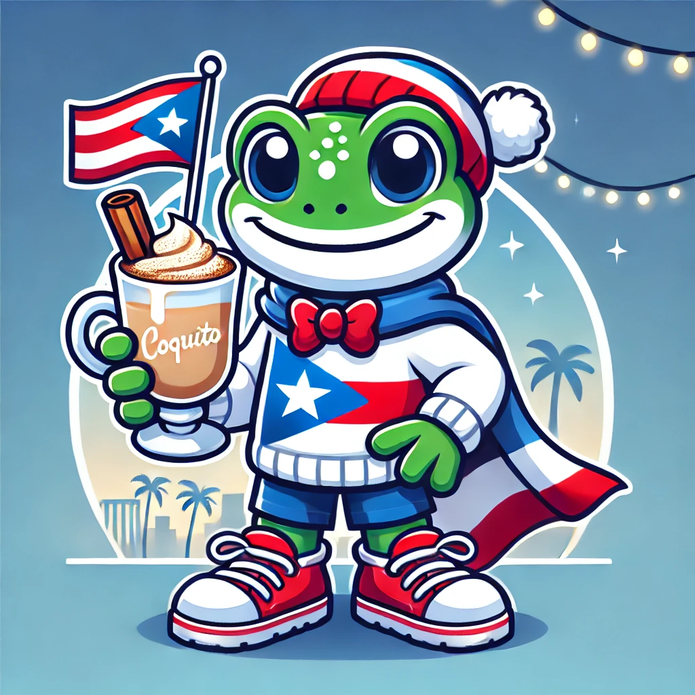

```{=html}
<style>
#title-block-header {
  display: none;
}

/* Uses shared tokens from styles.css: --accent, --bg-secondary, --text-secondary, --border */

.community-shell {
  max-width: 100%;
  margin: 0 auto;
  padding: 3rem clamp(1rem, 2vw, 2rem) 5rem;
}

.community-kicker,
.community-section-heading {
  font-size: 0.75rem;
  font-weight: 700;
  text-transform: uppercase;
  letter-spacing: 0.12em;
}

.community-kicker {
  color: var(--accent);
  margin: 0 0 0.45rem;
}

.community-title {
  margin: 0 0 0.9rem;
  font-size: clamp(2rem, 3.6vw, 3rem);
  font-weight: 700;
  line-height: 1.05;
}

.community-intro {
  max-width: 50rem;
  margin: 0 0 2.5rem;
  color: var(--text-secondary);
  font-size: 1rem;
  line-height: 1.75;
}

.community-section-heading {
  color: var(--text-secondary);
  margin: 0 0 1rem;
}

.community-feature,
.community-events,
.hobbies-feature {
  border: 1px solid var(--border);
  border-radius: 1.35rem;
  background: var(--bg-secondary);
  transition: border-color 0.2s ease, box-shadow 0.2s ease;
}

.community-feature:hover,
.community-events:hover,
.hobbies-feature:hover {
  border-color: rgba(37, 99, 235, 0.25);
  box-shadow: 0 4px 16px rgba(0, 0, 0, 0.05);
}

.community-feature {
  display: grid;
  grid-template-columns: minmax(0, 1.05fr) minmax(22rem, 0.95fr);
  gap: 1.75rem;
  padding: 1.75rem;
  margin-bottom: 3rem;
}

.feature-title,
.hobbies-title {
  margin: 0 0 0.55rem;
  font-size: 1.25rem;
  font-weight: 700;
}

.feature-copy,
.hobbies-copy,
.event-copy,
.event-list {
  color: var(--text-secondary);
  font-size: 0.96rem;
  line-height: 1.72;
}

.feature-copy p {
  margin: 0 0 1rem;
}

.feature-copy p:last-child {
  margin-bottom: 0;
}

.feature-points {
  margin: 0 0 1.25rem;
  padding-left: 1.2rem;
  color: var(--text-secondary);
}

.feature-points li + li {
  margin-top: 0.55rem;
}

.feature-gallery {
  display: grid;
  grid-template-columns: minmax(0, 1.7fr) minmax(0, 1fr);
  gap: 0.9rem;
  align-items: start;
}

.feature-figure {
  margin: 0;
}

.feature-figure img {
  width: 100%;
  height: 100%;
  display: block;
  border-radius: 1rem;
  object-fit: cover;
}

.feature-figure.contain img {
  object-fit: contain;
  height: auto;
  max-height: 10.75rem;
  background: var(--bs-body-bg, #fff);
  padding: 0.55rem;
}

.feature-figure figcaption {
  margin-top: 0.45rem;
  color: var(--text-secondary);
  font-size: 0.82rem;
  line-height: 1.45;
  text-align: center;
}

.feature-gallery-stack {
  display: flex;
  flex-direction: column;
  gap: 0.9rem;
  align-self: start;
}

.feature-gallery-stack .feature-figure {
  flex: 0 0 auto;
}

.community-events {
  padding: 0;
  overflow: hidden;
  margin-bottom: 3rem;
}

.events-shell {
  display: grid;
  grid-template-columns: 15rem minmax(0, 1fr);
}

.events-intro {
  padding: 1.6rem;
  border-right: 1px solid var(--border);
}

.events-intro p:last-child {
  margin-bottom: 0;
}

.events-scroll {
  max-height: 34rem;
  overflow-y: auto;
  padding: 1.25rem;
}

.season-block + .season-block {
  margin-top: 1.25rem;
}

.season-header {
  margin-bottom: 0.85rem;
}

.event-card {
  padding: 1.05rem;
  border-radius: 1rem;
  border: 1px solid var(--border);
  background: var(--bs-body-bg, #fff);
  transition: border-color 0.2s ease, box-shadow 0.2s ease;
}

.event-card:hover {
  border-color: rgba(37, 99, 235, 0.25);
  box-shadow: 0 2px 8px rgba(0, 0, 0, 0.05);
}

.event-card + .event-card {
  margin-top: 0.8rem;
}

.event-season {
  margin: 0 0 0.35rem;
  color: var(--accent);
  font-size: 0.8rem;
  font-weight: 700;
  letter-spacing: 0.05em;
  text-transform: uppercase;
}

.event-title {
  margin: 0 0 0.55rem;
  font-size: 1rem;
  font-weight: 700;
}

.event-copy {
  margin: 0 0 0.8rem;
}

.event-list {
  margin: 0;
  padding-left: 1.1rem;
}

.event-list li + li {
  margin-top: 0.45rem;
}

.hobbies-feature {
  padding: 1.6rem;
}

.hobbies-grid {
  display: grid;
  grid-template-columns: repeat(4, minmax(0, 1fr));
  gap: 1rem;
  margin-top: 1.25rem;
}

.hobby-card {
  padding: 1.15rem;
  border-radius: 1rem;
  border: 1px solid var(--border);
  background: var(--bs-body-bg, #fff);
  transition: border-color 0.2s ease, box-shadow 0.2s ease, transform 0.2s ease;
}

.hobby-card:hover {
  border-color: rgba(37, 99, 235, 0.3);
  box-shadow: 0 2px 12px rgba(0, 0, 0, 0.06);
  transform: translateY(-2px);
}

.hobby-card h3 {
  margin: 0 0 0.45rem;
  font-size: 1rem;
  font-weight: 700;
}

.hobby-card p {
  margin: 0;
  color: var(--text-secondary);
  font-size: 0.94rem;
  line-height: 1.68;
}

.interest-tags {
  display: flex;
  flex-wrap: wrap;
  gap: 0.75rem;
  margin-top: 1.15rem;
}

.interest-tag {
  padding: 0.55rem 1rem;
  border-radius: 999px;
  border: 1px solid var(--border);
  color: var(--text-secondary);
  font-size: 0.9rem;
  font-weight: 500;
  background: transparent;
}

.community-links {
  display: flex;
  gap: 0.85rem;
  flex-wrap: wrap;
  margin-top: 1.4rem;
}

.community-link {
  display: inline-flex;
  align-items: center;
  justify-content: center;
  padding: 0.8rem 1.05rem;
  border-radius: 0.9rem;
  border: 1px solid var(--border);
  text-decoration: none;
  font-weight: 600;
  transition: background 0.15s ease, border-color 0.15s ease, opacity 0.15s ease;
}

.community-link.primary {
  background: var(--accent);
  border-color: var(--accent);
  color: #fff;
}

.community-link.primary:hover,
.community-link.primary:focus {
  color: #fff;
  opacity: 0.92;
}

@media (max-width: 980px) {
  .community-feature,
  .hobbies-grid {
    grid-template-columns: 1fr;
  }

  .events-shell {
    grid-template-columns: 1fr;
  }

  .events-intro {
    border-right: none;
    border-bottom: 1px solid var(--border);
  }

  .events-scroll {
    max-height: none;
  }
}

@media (max-width: 640px) {
  .community-shell {
    padding: 2.5rem 1rem 4rem;
  }

  .feature-gallery {
    grid-template-columns: 1fr;
  }
}
</style>

<div class="community-shell">
  <p class="community-kicker">Community &amp; Hobbies</p>
  <p class="community-title">The part of the story that is not just papers and control theory.</p>
  <p class="community-intro">
    Research is a big part of my life, but it is not the only part that matters. This page holds the longer version of the community work, culture, and everyday interests that keep the rest of it grounded.
  </p>

  <p class="community-section-heading">Community</p>
  <section class="community-feature">
    <div class="feature-copy">
      <p class="feature-title">BORI at Georgia Tech</p>
      <p>
        I co-founded <strong>BORI (Boricuas Organized for Impact)</strong> to make sure Puerto Rican students at Georgia Tech had a space that felt familiar, welcoming, and genuinely useful. The goal was never just to start another campus organization. It was to build something that could help people feel recognized and at home.
      </p>
      <ul class="feature-points">
        <li>We built events around culture, food, and friendship rather than treating community as an afterthought.</li>
        <li>We focused on making newer students feel less alone when arriving in Atlanta and Georgia Tech.</li>
        <li>BORI gave me a way to stay connected to Puerto Rico while helping make campus feel more human for others too.</li>
      </ul>
      <p>
        That side of my life matters for the same reason the research does: both are about building systems that people can trust.
      </p>
    </div>
    <div class="feature-gallery">
      <figure class="feature-figure">
        
        <figcaption>BORI co-founders, left to right: Gustavo, Camelia, Evanns</figcaption>
      </figure>
      <div class="feature-gallery-stack">
        <figure class="feature-figure contain">
          
          <figcaption>The BORI logo</figcaption>
        </figure>
        <figure class="feature-figure contain">
          
          <figcaption>The BORI mascot: Coquí with Coquito</figcaption>
        </figure>
      </div>
    </div>
  </section>

  <p class="community-section-heading">BORI Moments</p>
  <section class="community-events">
    <div class="events-shell">
      <div class="events-intro">
        <p class="feature-title">Event history</p>
        <p class="event-copy">
          I'll update these with pictures and videos as well coming up soon &#128578
        </p>
      </div>
      <div class="events-scroll">
        <div class="season-block">
          <div class="season-header">
            <p class="event-season">Fall 2024</p>
          </div>

          <article class="event-card">
            <p class="event-title">Inaugural BORI Event</p>
            <ul class="event-list">
              <li>Homemade coquito, sandwiches de mezclita, sorullitos.</li>
              <li>Introduced everyone to the club and its purpose and vision.</li>
            </ul>
          </article>

          <article class="event-card">
            <p class="event-title">Trivia Night with Snacks</p>
            <ul class="event-list">
              <li>Puerto Rico trivia questions.</li>
              <li>Snacks and a lower-pressure social setting.</li>
            </ul>
          </article>
        </div>

        <div class="season-block">
          <div class="season-header">
            <p class="event-season">Spring 2025</p>
          </div>

          <article class="event-card">
            <p class="event-title">Winter Org Fair · Enero 30 · 11am-1pm</p>
            <ul class="event-list">
              <li>Poster, banderitas, bocina, Hershey Kisses.</li>
            </ul>
          </article>

          <article class="event-card">
            <p class="event-title">BORI Kickoff · Febrero 6 · 5pm</p>
            <ul class="event-list">
              <li>Coquito, sandwiches de mezclita, sorullitos.</li>
            </ul>
          </article>

          <article class="event-card">
            <p class="event-title">Festival de Chocolate · Febrero 21</p>
            <ul class="event-list">
              <li>Fresas con chocolate, tierrita, start-stop running game, papa caliente.</li>
              <li>The Standard rooftop area.</li>
            </ul>
          </article>

          <article class="event-card">
            <p class="event-title">March Gladness · Marzo 6</p>
            <ul class="event-list">
              <li>Tabling event with a traditional Puerto Rican jacks game.</li>
            </ul>
          </article>

          <article class="event-card">
            <p class="event-title">BORI Game Night · Marzo 13</p>
            <ul class="event-list">
              <li>Traditional Puerto Rican games and Puerto Rico-themed games.</li>
              <li>Snacks.</li>
            </ul>
          </article>
        </div>

        <div class="season-block">
          <div class="season-header">
            <p class="event-season">Fall 2025</p>
          </div>

          <article class="event-card">
            <p class="event-title">Freshman Kickoff · Agosto 12 · 1:15pm · Skiles 169</p>
            <ul class="event-list">
              <li>Bienvenidos a GT and Atlanta, with an emphasis on being a resource for new students from Puerto Rico.</li>
              <li>Krispy Kreme donuts.</li>
            </ul>
          </article>

          <article class="event-card">
            <p class="event-title">Fall Org Fair · Agosto 27 · 11am-1pm · Tech Green</p>
            <ul class="event-list">
              <li>Poster, banderitas, bocina, Hershey Kisses.</li>
            </ul>
          </article>

          <article class="event-card">
            <p class="event-title">BORI KickOff · Septiembre 3 · 5:30pm · Boggs 103</p>
            <ul class="event-list">
              <li>Publix cookies, snacks tipicos, dulcecitos.</li>
            </ul>
          </article>

          <article class="event-card">
            <p class="event-title">BORI Professional Panel · Septiembre 24 · 5pm · IC Building</p>
            <ul class="event-list">
              <li>Prepared questions and participant gifts.</li>
            </ul>
          </article>

          <article class="event-card">
            <p class="event-title">Dominos Tournament · Octubre · 11am-1pm · Kendeda Building</p>
            <ul class="event-list">
              <li>Funding request for $200.</li>
              <li>Dominoes, Papi's Cuban catered empanadas, prizes.</li>
            </ul>
          </article>

          <article class="event-card">
            <p class="event-title">Vamo a Jugal' · Octubre 10 · 4pm · Piedmont Park</p>
            <ul class="event-list">
              <li>Limber de parcha, cherry, and coco.</li>
              <li>Soccer, volleyball, football, and a bocina for an active outdoor event.</li>
            </ul>
          </article>

          <article class="event-card">
            <p class="event-title">Movie Night · Noviembre 13 · 7pm · The Connector Apt</p>
            <ul class="event-list">
              <li>Reserved the big screen on the 7th floor.</li>
              <li>Puerto Rican film, popcorn, snacks.</li>
            </ul>
          </article>

          <article class="event-card">
            <p class="event-title">Taller Coquito · Noviembre · 7pm · The Standard Apt</p>
            <ul class="event-list">
              <li>Leche evaporada, leche condensada, crema de coco, canela molida, vainilla.</li>
              <li>Glass bottles so people could take home the coquito they made.</li>
            </ul>
          </article>

        </div>

        <div class="season-block">
          <div class="season-header">
            <p class="event-season">Spring 2026</p>
          </div>

          <article class="event-card">
            <p class="event-title">Resume Review Workshop · Enero 22, 2026 · Crossland 2157</p>
            <ul class="event-list">
              <li>Professional-development event focused on strengthening resumes and preparing members for internship and full-time applications.</li>
            </ul>
          </article>

          <article class="event-card">
            <p class="event-title">Cafezinho com Brasa · Enero 29, 2026 · The Connector 7th Floor</p>
            <ul class="event-list">
              <li>Joint social event with the Brazilian student organization to socialize and taste-test coffees from each other's countries.</li>
            </ul>
          </article>

          <article class="event-card">
            <p class="event-title">Joint General Body Meeting with ALPFA and Cisco · Febrero 3, 2026 · Scheller 300</p>
            <ul class="event-list">
              <li>Collaborative event with ALPFA where we hosted recruiters from Cisco.</li>
            </ul>
          </article>

          <article class="event-card">
            <p class="event-title">World Baseball Classic Watch Party · Marzo 6, 2026 · Inspire Apt</p>
            <ul class="event-list">
              <li>Watched Team Puerto Rico take on Colombia together and turned it into a community hangout around baseball and home-team energy.</li>
            </ul>
          </article>
        </div>
      </div>
    </div>
  </section>

  <p class="community-section-heading">Hobbies</p>
  <section class="hobbies-feature">
    <p class="hobbies-title">Do Ph.D Students Have Lives?</p>
    <p class="hobbies-copy">
      When I'm not exercising my weak brain muscles I try to work out my other muscles, mainly so I can afford to indulge in my main hobby of cooking. When an find the time and discipline, I also love practicing my salsa technique at my dance studio and out at socials, as well as reading books about history, psychology and, recently, memoirs.
    </p>

    <div class="hobbies-grid">
      <article class="hobby-card">
        <h3>Fitness</h3>
        <p>To lift or not to lift, that is the question.</p>
      </article>
      <article class="hobby-card">
        <h3>Cooking</h3>
        <p>I'm my own private chef. And my client has exotic taste.</p>
      </article>
      <article class="hobby-card">
        <h3>Dance</h3>
        <p>Meh I'm getting better.</p>
      </article>
      <article class="hobby-card">
        <h3>Reading</h3>
        <p>I do eventually finish books I start after the fifth time I try reading them.</p>
      </article>
    </div>

    <!-- <div class="interest-tags">
      <span class="interest-tag">Fitness</span>
      <span class="interest-tag">Cooking</span>
      <span class="interest-tag">Dance</span>
      <span class="interest-tag">Reading</span>
      <span class="interest-tag">Writing</span>
      <span class="interest-tag">Film</span>
      <span class="interest-tag">Community Building</span>
    </div> -->

    <div class="community-links">
      <a class="community-link primary" href="../about/">Back to About Me</a>
      <a class="community-link" href="../journey/">Open Journey Map</a>
    </div>
  </section>
</div>
```
