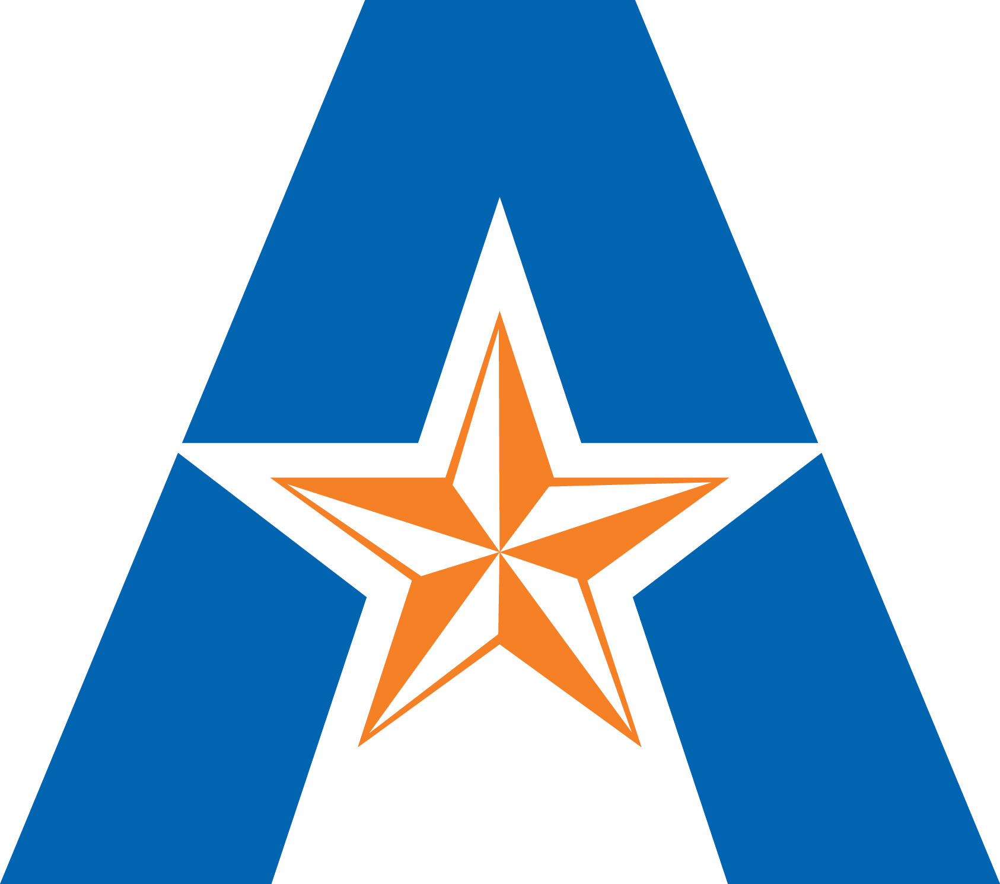
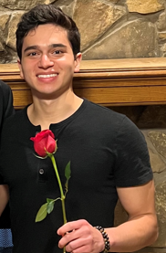

```{=html}
<style>
#title-block-header {
  display: none;
}
</style>

<div class="home-page">
  <section class="home-hero">
    <div class="home-hero-copy">
      <p class="home-hero-kicker">Robotics Ph.D student · Georgia Tech</p>
      <h1 class="home-hero-title">Evanns Morales-Cuadrado</h1>
      <p class="home-hero-summary">
        I work on safe autonomy for hardware systems, especially quadrotor UAVs, with an emphasis on nonlinear control, trajectory planning, and getting theory to survive contact with real platforms.
      </p>
      <p class="home-edu-heading">Education</p>
      <div class="home-meta-grid">
        <div class="home-meta-card">
          <div class="home-meta-card-header">
            
            <div>
              <p class="home-meta-value">Ph.D. in Robotics · Georgia Tech</p>
              <p class="home-meta-subtle">4.0 GPA · Summa Cum Laude · Deploy Novel Safe Autonomy Algorithms on Hardware · Aug 2022 - Present</p>
            </div>
          </div>
          <span class="home-meta-badge">#2 Public ECE Program in the U.S.</span>
          <span class="home-meta-badge">Ph.D. under <a href="https://scholar.google.com/citations?user=jVFH7asAAAAJ" target="_blank">Dr. Samuel Coogan</a>, Eckman Award recipient</span>
        </div>
        <div class="home-meta-card">
          <div class="home-meta-card-header">
            
            <div>
              <p class="home-meta-value">Honors B.S. in EE · UT Arlington</p>
              <p class="home-meta-subtle">Summa Cum Laude · Minors in Math & Physics · Certificate in Unmanned Vehicle Systems</p>
            </div>
          </div>
          <span class="home-meta-badge">Mentored by <a href="https://scholar.google.com/citations?user=rMRit3UAAAAJ" target="_blank">Dr. Frank Lewis</a></span>
          <span class="home-meta-badge">World #1 in Optimal Control & Reinforcement Learning</span>
          <span class="home-meta-badge">Top 1% Cited Researcher in the World</span>
        </div>
      </div>
      <div class="home-contact-list">
        <span class="home-contact-item">egm [at] gatech [dot] edu</span>
        <span class="home-contact-item">evannsmc [at] gmail [dot] com</span>
        <span class="home-contact-item">Atlanta, GA</span>
      </div>
      <div class="home-link-row">
        <a class="home-link-pill primary" href="https://github.com/evannsm" target="_blank">GitHub</a>
        <a class="home-link-pill primary" href="https://www.linkedin.com/in/evanns-morales/" target="_blank">LinkedIn</a>
        <a class="home-link-pill primary" href="https://scholar.google.com/citations?user=FY9tS9oAAAAJ&hl=en" target="_blank">Google Scholar</a>
        <a class="home-link-pill primary" href="https://orcid.org/0009-0000-3928-6243" target="_blank">ORCID</a>
      </div>
    </div>
    <figure class="home-hero-sidebar">
      
      <figcaption class="home-hero-caption">C'est Moi.</figcaption>
    </figure>
  </section>
</div>
```


## Inside the Lab

I am a Robotics/ECE Ph.D student in the Formal Methods & Autonomous Control of Transportation Systems ([FACTS](https://coogan.ece.gatech.edu/)) Lab at the Georgia Institute of Technology under the supervision of Dr. Samuel Coogan.

My research is centered around safe autonomy of hardware systems, primarily focusing on quadrotor unmanned aerial vehicles (UAVs), and some unmanned ground vehicles as well (UGVs). In particular, I work on safe and efficient path planning and control synthesis, often in the face of computational limitations on the hardware end.

I hope to walk the tightrope between theory and hardware implementation as seamlessly as possible and make contributions on both ends throughout my career.


## My Latest Project

```{=html}
<a class="home-latest-project" href="./projects/rtd-rax/">
  <div class="home-latest-project-copy">
    <!-- <p class="home-snapshot-kicker">My latest project</p> -->
    <p class="home-latest-project-title"><code>RTD-RAX</code>.</p>
    <!-- <p class="home-latest-project-title">'RTD-RAX.'</p> -->
    <p class="home-latest-project-text">
      Runtime-assurance trajectory planning, with online verification and repair instead of conservative offline safety buffers.
      RTD-RAX extends Reachability-based Trajectory Design by separating fast candidate generation from online safety certification. The planner stays agile, while a verifier certifies each trajectory under the actual measured conditions and repairs unsafe candidates before execution. 
    </p>
    <span class="home-latest-project-link">Open RTD-RAX</span>
  </div>
  <div class="home-latest-project-preview">
    
  </div>
</a>
```


## Beyond the Lab

```{=html}
<div class="home-snapshot">
  <div class="home-snapshot-grid">
    <div class="home-snapshot-card">
      <p class="home-snapshot-kicker">Roots</p>
      <p class="home-snapshot-title">Puerto Rico is still central.</p>
      <p class="home-snapshot-copy">
        I was born and raised in Puerto Rico until I was 9, and that sense of home still shapes how I think about culture, belonging, and community.
      </p>
    </div>
    <div class="home-snapshot-card">
      <p class="home-snapshot-kicker">Journey</p>
      <p class="home-snapshot-title">The path keeps widening.</p>
      <p class="home-snapshot-copy">
        From UT Arlington to Georgia Tech, then Toronto for ACC 2024, and next to Albuquerque for a Summer 2026 internship at Sandia National Laboratories.
      </p>
    </div>
    <div class="home-snapshot-card">
      <p class="home-snapshot-kicker">Community</p>
      <p class="home-snapshot-title">BORI matters as much as the research.</p>
      <p class="home-snapshot-copy">
        At Georgia Tech I helped co-found "BORI" to provide a welcoming place for Puerto Rican students and promote our culture across campus.
      </p>
    </div>
  </div>
  <div class="home-snapshot-links">
    <a class="home-snapshot-link primary" href="./about/">More About Me</a>
    <a class="home-snapshot-link" href="./journey/">Open Journey Map</a>
  </div>
</div>
```
