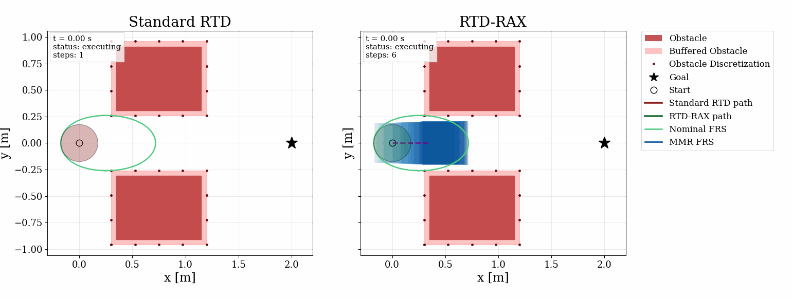

# Welcome to Evannsmc

egm \[at\] gatech \[dot\] edu

evannsmc \[at\] gmail \[dot\] com

Georgia Institute of Technology | Atlanta, GA
PhD in Robotics | Aug 2022 - Present

University of Texas at Arlington | Arlington, TX
Honors B.S in Electrical Engineering | Aug 2018 - May 2022
Minors in Mathematics and Physics
Summa Cum Laude


## Inside the Lab

I am a Robotics/ECE Ph.D student in the Formal Methods & Autonomous Control of Transportation Systems ([FACTS](https://coogan.ece.gatech.edu/)) Lab at the Georgia Institute of Technology under the supervision of Dr. Samuel Coogan.

My research is centered around safe autonomy of hardware systems, primarily focusing on quadrotor unmanned aerial vehicles (UAVs), and some unmanned ground vehicles as well (UGVs). In particular, I work on safe and efficient path planning and control synthesis, often in the face of computational limitations on the hardware end.

I hope to walk the tightrope between theory and hardware implementation as seamlessly as possible and make contributions on both ends throughout my career.


## Beyond the Lab

```{=html}
<div class="home-snapshot">
  <div class="home-snapshot-grid">
    <div class="home-snapshot-card">
      <p class="home-snapshot-kicker">Roots</p>
      <p class="home-snapshot-title">Puerto Rico is still central.</p>
      <p class="home-snapshot-copy">
        I was born and raised in Puerto Rico until I was 9, and that sense of home still shapes how I think about culture, belonging, and community.
      </p>
    </div>
    <div class="home-snapshot-card">
      <p class="home-snapshot-kicker">Community</p>
      <p class="home-snapshot-title">BORI matters as much as the research.</p>
      <p class="home-snapshot-copy">
        At Georgia Tech I helped co-found BORI to make campus feel more welcoming and culturally familiar for Puerto Rican students.
      </p>
    </div>
    <div class="home-snapshot-card">
      <p class="home-snapshot-kicker">Journey</p>
      <p class="home-snapshot-title">The path keeps widening.</p>
      <p class="home-snapshot-copy">
        From UT Arlington to Georgia Tech, then Toronto for ACC 2024, and next to Albuquerque for a Summer 2026 internship at Sandia National Laboratories.
      </p>
    </div>
  </div>
  <a class="home-latest-project" href="./projects/rtd-rax/">
    <div class="home-latest-project-copy">
      <p class="home-snapshot-kicker">My latest project</p>
      <p class="home-latest-project-title">RTD-RAX is the current one I am most excited about.</p>
      <p class="home-latest-project-text">
        Runtime-assurance trajectory planning for quadrotors, with online verification and repair instead of conservative offline safety buffers.
      </p>
      <span class="home-latest-project-link">Open RTD-RAX</span>
    </div>
    <div class="home-latest-project-preview">
      
    </div>
  </a>
  <div class="home-snapshot-links">
    <a class="home-snapshot-link primary" href="./about/">More About Me</a>
    <a class="home-snapshot-link" href="./journey/">Open Journey Map</a>
  </div>
</div>
```
