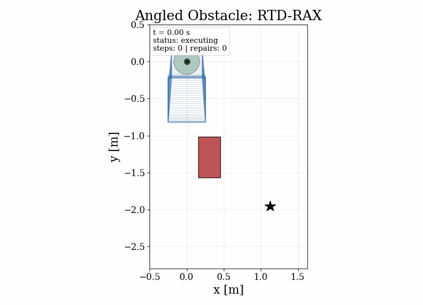

```{=html}
<style>
#title-block-header {
  display: none;
}

/* Wider layout for 2-column projects */
.page-columns {
  grid-template-columns: [screen-start] 5rem [screen-start-inset] 0 [page-start] 0 [page-start-inset] 0 [body-start-outset] 0 [body-start] 0 [body-content-start] 1fr [body-content-end] 0 [body-end] 0 [body-end-outset] 0 [page-end-inset] 0 [page-end] 0 [screen-end-inset] 5rem [screen-end] !important;
}

main.content.column-page {
  padding-left: 0 !important;
  padding-right: 0 !important;
}

:root {
  --projects-accent: #2563eb;
  --projects-bg-secondary: #e8eef8;
  --projects-text-secondary: var(--bs-secondary-color, #57534e);
  --projects-border: #a8a4a0;
}

.projects-shell {
  max-width: 100%;
  margin: 0 auto;
  padding: 3rem 1.25rem 5rem;
}

.projects-page-title {
  margin: 0 0 2rem;
  font-size: clamp(2rem, 3.6vw, 3rem);
  font-weight: 700;
  line-height: 1.05;
}

.projects-columns {
  display: grid;
  grid-template-columns: 1fr 1fr;
  gap: 2.5rem;
  align-items: start;
}

.projects-column-heading {
  margin: 0 0 0.45rem;
  font-size: 0.75rem;
  font-weight: 700;
  text-transform: uppercase;
  letter-spacing: 0.12em;
  color: var(--projects-accent);
}

.projects-column-title {
  margin: 0 0 0.5rem;
  font-size: 1.3rem;
  font-weight: 700;
  line-height: 1.15;
}

.projects-column-intro {
  margin: 0 0 1.4rem;
  color: var(--projects-text-secondary);
  font-size: 0.95rem;
  line-height: 1.7;
}

.project-stack {
  display: grid;
  gap: 1rem;
}

.project-card {
  border: 1.5px solid var(--projects-border);
  border-radius: 1.35rem;
  background: var(--projects-bg-secondary);
  overflow: hidden;
}

.project-card summary {
  list-style: none;
  cursor: pointer;
}

.project-card summary::-webkit-details-marker {
  display: none;
}

.project-summary {
  display: grid;
  grid-template-columns: 1fr;
  gap: 1rem;
  padding: 1.55rem;
}

.project-copy {
  min-width: 0;
}

.project-tags {
  display: flex;
  flex-wrap: wrap;
  gap: 0.55rem;
  margin-bottom: 0.8rem;
}

.project-tag {
  padding: 0.32rem 0.7rem;
  border-radius: 999px;
  border: 1.5px solid var(--projects-border);
  color: var(--projects-text-secondary);
  font-size: 0.78rem;
  font-weight: 600;
  background: var(--bs-body-bg, #fff);
}

.project-name-row {
  display: flex;
  align-items: center;
  justify-content: space-between;
  gap: 1rem;
  margin-bottom: 0.6rem;
}

.project-name-group {
  display: flex;
  align-items: center;
  gap: 0.75rem;
  min-width: 0;
}

.project-number {
  display: inline-flex;
  align-items: center;
  justify-content: center;
  width: 2rem;
  height: 2rem;
  border-radius: 999px;
  background: rgba(37, 99, 235, 0.1);
  color: var(--projects-accent);
  font-size: 0.82rem;
  font-weight: 800;
  letter-spacing: 0.04em;
  flex-shrink: 0;
}

.project-name {
  margin: 0;
  font-size: 1.28rem;
  font-weight: 700;
}

.project-toggle {
  color: var(--projects-text-secondary);
  font-size: 0.82rem;
  font-weight: 700;
  white-space: nowrap;
}

.project-card[open] .project-toggle::before {
  content: "Hide details";
}

.project-card:not([open]) .project-toggle::before {
  content: "Expand";
}

.project-preview-copy {
  margin: 0;
  color: var(--projects-text-secondary);
  font-size: 0.96rem;
  line-height: 1.72;
}

.project-preview-panel {
  display: flex;
  align-items: stretch;
  min-height: 12rem;
  border: 1.5px solid var(--projects-border);
  border-radius: 1rem;
  background: var(--bs-body-bg, #fff);
  overflow: hidden;
}

.project-preview-panel img {
  width: 100%;
  height: 100%;
  object-fit: cover;
  display: block;
}

.project-preview-panel.rtd-preview img {
  width: 105.5%;
  height: 100%;
  max-width: none;
  object-fit: cover;
  object-position: left center;
  background: var(--bs-body-bg, #fff);
}

.project-preview-panel.rtd-preview {
  min-height: 0;
  aspect-ratio: 1.4 / 1;
}

.project-preview-custom {
  width: 100%;
  padding: 1.15rem;
  display: flex;
  flex-direction: column;
  justify-content: space-between;
  gap: 1rem;
  background:
    radial-gradient(circle at top right, rgba(37, 99, 235, 0.12), transparent 35%),
    linear-gradient(180deg, rgba(59, 130, 246, 0.08), rgba(59, 130, 246, 0.02));
}

.project-preview-title {
  margin: 0;
  font-size: 0.84rem;
  font-weight: 700;
  letter-spacing: 0.06em;
  text-transform: uppercase;
  color: var(--projects-accent);
}

.project-preview-lines {
  display: grid;
  gap: 0.45rem;
}

.project-preview-line {
  padding: 0.55rem 0.7rem;
  border-radius: 0.8rem;
  background: rgba(255, 255, 255, 0.92);
  color: var(--projects-text-secondary);
  font-size: 0.87rem;
  font-weight: 600;
}

.project-preview-metrics {
  display: flex;
  flex-wrap: wrap;
  gap: 0.6rem;
}

.project-preview-metric {
  padding: 0.45rem 0.7rem;
  border-radius: 0.8rem;
  background: rgba(37, 99, 235, 0.08);
  color: var(--projects-accent);
  font-size: 0.8rem;
  font-weight: 700;
}

.project-body {
  padding: 0 1.55rem 1.55rem;
  border-top: 1.5px solid var(--projects-border);
}

.project-body-grid {
  display: grid;
  grid-template-columns: 1fr;
  gap: 1.25rem;
  padding-top: 1.2rem;
}

.project-detail-copy {
  color: var(--projects-text-secondary);
  font-size: 0.95rem;
  line-height: 1.72;
}

.project-detail-copy p {
  margin: 0 0 0.9rem;
}

.project-detail-copy p:last-child {
  margin-bottom: 0;
}

.project-detail-list {
  margin: 0;
  padding-left: 1.15rem;
  color: var(--projects-text-secondary);
}

.project-detail-list li + li {
  margin-top: 0.45rem;
}

.project-actions {
  display: flex;
  flex-wrap: wrap;
  gap: 0.75rem;
  align-content: flex-start;
}

.project-action {
  display: inline-flex;
  align-items: center;
  justify-content: center;
  padding: 0.8rem 1rem;
  border-radius: 0.9rem;
  border: 1.5px solid var(--projects-border);
  text-decoration: none;
  font-weight: 600;
  background: var(--bs-body-bg, #fff);
}

.project-action.primary {
  background: var(--projects-accent);
  border-color: var(--projects-accent);
  color: #fff;
}

.project-action.primary:hover,
.project-action.primary:focus {
  color: #fff;
  opacity: 0.92;
}

@media (max-width: 1100px) {
  .projects-columns {
    grid-template-columns: 1fr;
  }
}

@media (max-width: 640px) {
  .projects-shell {
    padding: 2.5rem 1rem 4rem;
  }

  .project-name-row {
    flex-direction: column;
    align-items: flex-start;
  }
}
</style>

<div class="projects-shell">
  <p class="projects-page-title">Research & Open-Source Builds.</p>

  <div class="projects-columns">
    <!-- LEFT COLUMN: Research Projects -->
    <div>
      <p class="projects-column-heading">Research Projects</p>
      <!-- <p class="projects-column-title">Published research work.</p> -->
      <p class="projects-column-intro">
        Research projects in safe autonomous control for unmanned aerial and ground vehicles.
      </p>

      <div class="project-stack">
        <details class="project-card">
          <summary>
            <div class="project-summary">
              <div class="project-copy">
                <div class="project-tags">
                  <span class="home-latest-project-tag">Real-Time Planning</span>
                  <span class="home-latest-project-tag">Disturbance Handling</span>
                  <span class="home-latest-project-tag">Reachability Analysis</span>
                  <span class="project-tag">Robotics</span>
                  <span class="project-tag">Safety</span>
                  <span class="project-tag">Research</span>
                </div>
                <div class="project-name-row">
                  <div class="project-name-group">
                    <span class="project-number">01</span>
                    <p class="project-name">RTD-RAX</p>
                  </div>
                  <span class="project-toggle"></span>
                </div>
                <p class="project-preview-copy">
                  Runtime-assurance trajectory planning for quadrotors, with online reachability verification and repair instead of overly conservative offline safety buffers.
                </p>
              </div>
              <div class="project-preview-panel rtd-preview">
                
              </div>
            </div>
          </summary>
          <div class="project-body">
            <div class="project-body-grid">
              <div class="project-detail-copy">
                <p>
                  RTD-RAX extends Reachability-based Trajectory Design by separating fast candidate generation from online safety certification. The planner stays agile, while a verifier certifies each trajectory under the actual measured conditions and repairs unsafe candidates before execution.
                </p>
                <ul class="project-detail-list">
                  <li>Mixed-monotone reachability verification at runtime via <code>immrax</code>.</li>
                  <li>Hybrid repair loop when a candidate cannot be certified safe.</li>
                  <li>Three case studies with manuscript-ready figure generation and Dockerized reproducibility.</li>
                </ul>
              </div>
              <div class="project-actions">
                <a class="project-action primary" href="../projects/rtd-rax/">Open Project Page</a>
                <!-- <a class="project-action" href="" target="_blank">MECC-ALDSC 2026 Paper (Preprint PDF) ↗</a> -->
                <a class="project-action" href="https://github.com/evannsm/rtd-rax" target="_blank">GitHub ↗</a>
                <a class="project-action" href="https://evannsm.github.io/ws_RTD" target="_blank">Dedicated Website ↗</a>
              </div>
            </div>
          </div>
        </details>

        <details class="project-card">
          <summary>
            <div class="project-summary">
              <div class="project-copy">
                <div class="project-tags">
                  <span class="project-tag">Control</span>
                  <span class="project-tag">Python</span>
                  <span class="project-tag">Research</span>
                </div>
                <div class="project-name-row">
                  <div class="project-name-group">
                    <span class="project-number">02</span>
                    <p class="project-name">NMPC Acados PX4</p>
                  </div>
                  <span class="project-toggle"></span>
                </div>
                <p class="project-preview-copy">
                  A clean NMPC baseline for quadrotor research built around Acados and QPOASES, with a full ROS 2 interface and real-time-ready generated code.
                </p>
              </div>
              <div class="project-preview-panel">
                <div class="project-preview-custom">
                  <p class="project-preview-title">Custom NMPC Implementation</p>
                  <div class="project-preview-lines">
                    <div class="project-preview-line">Fast Computation</div>
                    <div class="project-preview-line">Aggressive Trajectory Control</div>
                    <div class="project-preview-line">Smart, De-Coupled Yaw Tracking</div>
                  </div>
                  <div class="project-preview-metrics">
                    <span class="project-preview-metric">Acados</span>
                    <span class="project-preview-metric">QPOASES</span>
                    <span class="project-preview-metric">ROS 2</span>
                  </div>
                </div>
              </div>
            </div>
          </summary>
          <div class="project-body">
            <div class="project-body-grid">
              <div class="project-detail-copy">
                <p>
                  This controller served as the main comparison baseline for the Newton-Raphson Flow work. It is a solid reference implementation if you want a rigorous NMPC starting point rather than a highly specialized demo.
                </p>
                <ul class="project-detail-list">
                  <li>Jointly tracks position, velocity, and Euler angles.</li>
                  <li>Handles wrapped yaw error correctly.</li>
                  <li>Uses hard thrust and body-rate constraints with a clean command-line interface.</li>
                </ul>
              </div>
              <div class="project-actions">
                <a class="project-action primary" href="../projects/nmpc-acados/">Open Project Page</a>
                <a class="project-action" href="https://github.com/evannsm/nmpc_acados_px4" target="_blank">Python Version ↗</a>
                <a class="project-action" href="https://github.com/evannsm/nmpc_acados_px4_cpp" target="_blank">C++ Version ↗</a>
              </div>
            </div>
          </div>
        </details>

        <details class="project-card">
          <summary>
            <div class="project-summary">
              <div class="project-copy">
                <div class="project-tags">
                  <span class="project-tag">Safety</span>
                  <span class="project-tag">Formal Methods</span>
                  <span class="project-tag">Hybrid Systems</span>
                  <span class="project-tag">Research</span>
                </div>
                <div class="project-name-row">
                  <div class="project-name-group">
                    <span class="project-number">03</span>
                    <p class="project-name">Interval STL Runtime Assurance</p>
                  </div>
                  <span class="project-toggle"></span>
                </div>
                <p class="project-preview-copy">
                  Safe control from signal temporal logic safety specifications for linear systems with bounded uncertainty, using interval STL and runtime assurance with real-time MILP-based correction.
                </p>
              </div>
              <div class="project-preview-panel">
                <div class="project-preview-custom">
                  <p class="project-preview-title">NAHS 2025 submission</p>
                  <div class="project-preview-lines">
                    <div class="project-preview-line">Linear systems with bounded uncertainty</div>
                    <div class="project-preview-line">Minimal runtime input correction</div>
                    <div class="project-preview-line">Miniature autonomous blimp demo</div>
                  </div>
                  <div class="project-preview-metrics">
                    <span class="project-preview-metric">iSTL</span>
                    <span class="project-preview-metric">MILP</span>
                    <span class="project-preview-metric">NAHS</span>
                  </div>
                </div>
              </div>
            </div>
          </summary>
          <div class="project-body">
            <div class="project-body-grid">
              <div class="project-detail-copy">
                <p>
                  This project addresses safe control from signal temporal logic safety specifications for linear systems with bounded uncertainty in a static environment. A runtime-assurance layer evaluates the nominal controller's proposed input at each update step and minimally adjusts it whenever needed to maintain specification satisfaction under all realizations of the uncertainty.
                </p>
                <ul class="project-detail-list">
                  <li>Leverages interval signal temporal logic so uncertainty can be handled directly with only a modest program-size increase.</li>
                  <li>Solves a mixed-integer linear program at each controller update step and includes conditions that guarantee long-horizon feasibility.</li>
                  <li>Ensures a safe backup input is always available if a computation deadline is ever missed, and demonstrates real-time tractability on a miniature autonomous blimp.</li>
                </ul>
              </div>
              <div class="project-actions">
                <a class="project-action primary" href="../projects/nahs/">Open Project Page</a>
                <a class="project-action" href="https://papers.ssrn.com/sol3/Delivery.cfm?abstractid=6168587" target="_blank">NAHS 2025 Paper (Preprint PDF) ↗</a>
                <a class="project-action" href="../publications/">Publications ↗</a>
              </div>
            </div>
          </div>
        </details>

        <details class="project-card">
          <summary>
            <div class="project-summary">
              <div class="project-copy">
                <div class="project-tags">
                  <span class="project-tag">Control</span>
                  <span class="project-tag">Python</span>
                  <span class="project-tag">JAX</span>
                  <span class="project-tag">Research</span>
                </div>
                <div class="project-name-row">
                  <div class="project-name-group">
                    <span class="project-number">04</span>
                    <p class="project-name">Newton-Raphson Flow for PX4</p>
                  </div>
                  <span class="project-toggle"></span>
                </div>
                <p class="project-preview-copy">
                  A research-grade quadrotor controller that reframes tracking as a Newton-Raphson optimization problem and runs on real onboard hardware.
                </p>
              </div>
              <div class="project-preview-panel">
                <div class="project-preview-custom">
                  <p class="project-preview-title">Fast, Efficient Control Algorithm</p>
                  <div class="project-preview-lines">
                    <div class="project-preview-line">ACC 2024</div>
                    <div class="project-preview-line">TCST 2025</div>
                    <div class="project-preview-line">Onboard Quadrotor Deployment</div>
                  </div>
                  <div class="project-preview-metrics">
                    <span class="project-preview-metric">JAX JIT</span>
                    <span class="project-preview-metric">ROS 2</span>
                    <span class="project-preview-metric">PX4</span>
                  </div>
                </div>
              </div>
            </div>
          </summary>
          <div class="project-body">
            <div class="project-body-grid">
              <div class="project-detail-copy">
                <p>
                  NR Flow uses iterative Jacobian inversion for fast feedback linearization and folds integral control barrier functions into the controller to enforce actuator limits smoothly. It is meant to be practical, not just theoretical.
                </p>
                <ul class="project-detail-list">
                  <li>Runs comfortably on a Raspberry Pi 4 onboard a quadrotor.</li>
                  <li>Supports both simulation and hardware workflows.</li>
                  <li>Backed by multiple peer-reviewed papers rather than a one-off demo implementation.</li>
                </ul>
              </div>
              <div class="project-actions">
                <a class="project-action primary" href="../projects/nr-flow/">Open Project Page</a>
                <a class="project-action" href="https://arxiv.org/abs/2408.11197" target="_blank">ACC 2024 Paper (PDF) ↗</a>
                <a class="project-action" href="https://arxiv.org/abs/2508.14185" target="_blank">TCST 2025 Paper (PDF) ↗</a>
                <a class="project-action" href="https://github.com/evannsm/newton_raphson_px4" target="_blank">Python Version ↗</a>
                <a class="project-action" href="https://github.com/evannsm/newton_raphson_px4_cpp" target="_blank">C++ Version ↗</a>
              </div>
            </div>
          </div>
        </details>
      </div>
    </div>

    <!-- RIGHT COLUMN: Independent Projects -->
    <div>
      <p class="projects-column-heading">Independent Projects</p>
      <p class="projects-column-title">Open-source tools and infrastructure.</p>
      <p class="projects-column-intro">
        Standalone codebases, utilities, and templates that grew out of day-to-day research needs.
      </p>

      <div class="project-stack">
        <details class="project-card">
          <summary>
            <div class="project-summary">
              <div class="project-copy">
                <div class="project-tags">
                  <span class="project-tag">Quarto</span>
                  <span class="project-tag">LaTeX</span>
                  <span class="project-tag">Tools</span>
                </div>
                <div class="project-name-row">
                  <div class="project-name-group">
                    <span class="project-number">01</span>
                    <p class="project-name">QuartoCV</p>
                  </div>
                  <span class="project-toggle"></span>
                </div>
                <p class="project-preview-copy">
                  A modular Quarto and Make-based CV workflow that updates shared sections once and propagates them across every output document automatically.
                </p>
              </div>
              <div class="project-preview-panel">
                <div class="project-preview-custom">
                  <p class="project-preview-title">Build once, reuse everywhere</p>
                  <div class="project-preview-lines">
                    <div class="project-preview-line">Shared sections</div>
                    <div class="project-preview-line">Incremental PDF rebuilds</div>
                    <div class="project-preview-line">Academic + consulting styles</div>
                  </div>
                  <div class="project-preview-metrics">
                    <span class="project-preview-metric">Quarto</span>
                    <span class="project-preview-metric">XeLaTeX</span>
                    <span class="project-preview-metric">Make</span>
                  </div>
                </div>
              </div>
            </div>
          </summary>
          <div class="project-body">
            <div class="project-body-grid">
              <div class="project-detail-copy">
                <p>
                  QuartoCV is for the recurring academic problem of maintaining multiple CV and resume variants without duplicating the same content everywhere. Shared section files feed multiple outputs, and the Makefile rebuilds only the documents affected by an edit.
                </p>
                <ul class="project-detail-list">
                  <li>One source section can feed multiple document variants.</li>
                  <li>Dependency-aware incremental builds keep edits fast.</li>
                  <li>Layouts are designed for both compact academic and cleaner standard resume styles.</li>
                </ul>
              </div>
              <div class="project-actions">
                <a class="project-action primary" href="../projects/quartocv/">Open Project Page</a>
                <a class="project-action" href="https://github.com/evannsm/quartoCV" target="_blank">GitHub ↗</a>
              </div>
            </div>
          </div>
        </details>

        <details class="project-card">
          <summary>
            <div class="project-summary">
              <div class="project-copy">
                <div class="project-tags">
                  <span class="project-tag">Quarto</span>
                  <span class="project-tag">Tools</span>
                </div>
                <div class="project-name-row">
                  <div class="project-name-group">
                    <span class="project-number">02</span>
                    <p class="project-name">Quarto Georgia Tech Slides</p>
                  </div>
                  <span class="project-toggle"></span>
                </div>
                <p class="project-preview-copy">
                  A Georgia Tech-branded RevealJS presentation theme that installs into an existing Quarto project in one command.
                </p>
              </div>
              <div class="project-preview-panel">
                <div class="project-preview-custom">
                  <p class="project-preview-title">Slide branding</p>
                  <div class="project-preview-lines">
                    <div class="project-preview-line">Official GT palette</div>
                    <div class="project-preview-line">Title + section backgrounds</div>
                    <div class="project-preview-line">RevealJS fragments + callouts</div>
                  </div>
                  <div class="project-preview-metrics">
                    <span class="project-preview-metric">Quarto</span>
                    <span class="project-preview-metric">RevealJS</span>
                    <span class="project-preview-metric">SCSS</span>
                  </div>
                </div>
              </div>
            </div>
          </summary>
          <div class="project-body">
            <div class="project-body-grid">
              <div class="project-detail-copy">
                <p>
                  This extension packages Georgia Tech colors, backgrounds, typography, and presentation utilities so branded slides can be spun up quickly in a normal Quarto workflow.
                </p>
                <ul class="project-detail-list">
                  <li>Built to be installed into an existing project with a single template command.</li>
                  <li>Includes branded title and section slide treatments.</li>
                  <li>Designed for presentations that still feel like Quarto, not a hard-coded slide deck.</li>
                </ul>
              </div>
              <div class="project-actions">
                <a class="project-action primary" href="../projects/gatech-slides/">Open Project Page</a>
                <a class="project-action" href="https://github.com/evannsm/quarto-gatech-slides" target="_blank">GitHub ↗</a>
              </div>
            </div>
          </div>
        </details>
      </div>
    </div>
  </div>
</div>
```
