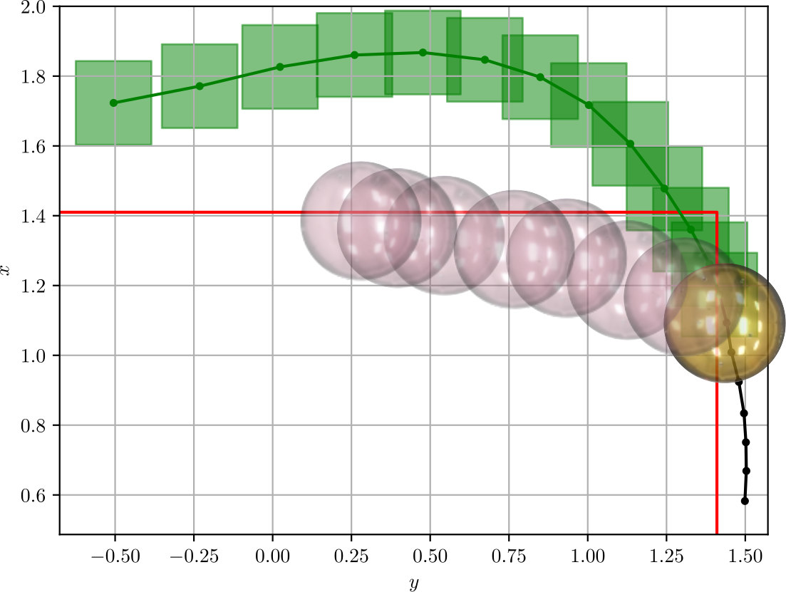
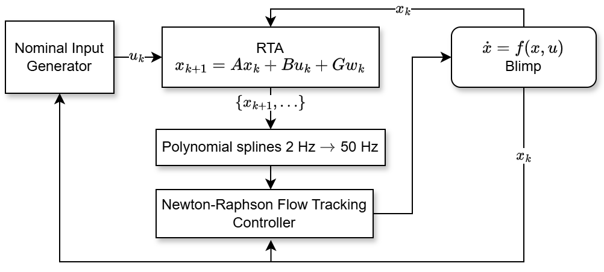

```{=html}
<style>
.nahs-figure-shell {
  margin: 1.75rem 0 2rem;
}

.nahs-figure-grid {
  display: grid;
  grid-template-columns: minmax(0, 1.05fr) minmax(0, 1fr);
  gap: 1rem;
  align-items: start;
}

.nahs-figure-card {
  margin: 0;
  padding: 0.85rem;
  border: 1px solid var(--bs-border-color, #dee2e6);
  border-radius: 1rem;
  background: var(--bs-body-bg, #fff);
}

.nahs-figure-card img {
  width: 100%;
  height: auto;
  display: block;
  border-radius: 0.75rem;
}

.nahs-figure-caption {
  margin-top: 0.9rem;
  color: var(--bs-secondary-color, #6c757d);
  font-size: 0.95rem;
  line-height: 1.7;
}

@media (max-width: 860px) {
  .nahs-figure-grid {
    grid-template-columns: 1fr;
  }
}
</style>
```

::: {.d-flex .gap-2 .flex-wrap .mb-3}
[NAHS 2025 Paper (PDF)](https://papers.ssrn.com/sol3/Delivery.cfm?abstractid=6168587){.btn .btn-sm .btn-primary target="_blank"}
:::

This paper addresses safe control from signal temporal logic safety specifications for linear systems with bounded uncertainty in a static environment. The core move is to use interval signal temporal logic (iSTL) so the runtime-assurance problem can explicitly accommodate uncertainty instead of pretending it is negligible or hiding it inside blunt worst-case margins.

At each controller update step, the runtime-assurance algorithm takes the input proposed by a nominal controller and minimally adjusts it when necessary so that the safety specification remains satisfied at all times under all realizations of the bounded disturbance. Like related temporal-logic synthesis approaches, the method solves a mixed-integer linear program online, but iSTL keeps the uncertainty overhead comparatively modest.

The paper, with Leslie Baird and Samuel Coogan, is currently under revision for IFAC *Nonlinear Analysis: Hybrid Systems* (NAHS). It sits on the more formal-methods side of the same safe-autonomy thread that runs through the rest of the work on this site, but it still stays grounded in a real experimental platform: a miniature autonomous blimp.

```{=html}
<div class="nahs-figure-shell">
  <div class="nahs-figure-grid">
    <figure class="nahs-figure-card">
      
    </figure>
    <figure class="nahs-figure-card">
      
    </figure>
  </div>
  <p class="nahs-figure-caption">
    Left: a nominal controller generates an unsafe blimp trajectory, while the runtime-assurance layer synthesizes a safe backup trajectory online under bounded disturbance. Right: the full control architecture, where a nominal policy feeds the runtime-assurance block, which synthesizes a safe reference at 2 Hz, up-samples it with polynomial splines to 50 Hz, and passes it to a Newton-Raphson Flow controller on the blimp.
  </p>
</div>
```

**Key ideas:**

- Use interval signal temporal logic to encode safety requirements under bounded uncertainty
- Minimally modify the nominal controller's proposed input instead of replacing the controller wholesale
- Solve an online MILP while retaining conditions that guarantee feasibility for all time
- Guarantee that a safe backup input is available even if a computation deadline is missed
- Demonstrate real-time computational tractability on a miniature autonomous blimp

**Academic foundation:**

| Venue | Status |
|---|---|
| IFAC *Nonlinear Analysis: Hybrid Systems* (NAHS) | Submitted, under revision |

**Built around:** Runtime assurance · Signal temporal logic · Interval analysis · Mixed-integer optimization · Hybrid systems
