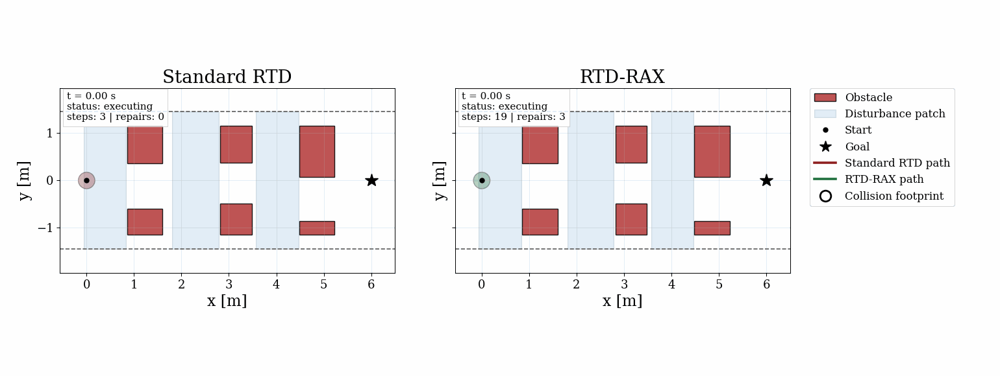

::: {.d-flex .gap-2 .mb-3}
[View on GitHub](https://github.com/evannsm/rtd-rax){.btn .btn-sm .btn-primary target="_blank"}
[Documentation](https://evannsm.github.io/ws_RTD){.btn .btn-sm .btn-outline-primary target="_blank"}
:::

`RTD-RAX` is a runtime-assurance extension of Reachability-based Trajectory Design (RTD) that replaces conservative offline reachable sets with fast online safety certification via mixed-monotone reachability ([immrax](https://github.com/gtfactslab/immrax)).

RTD precomputes Forward Reachable Sets (FRS) offline and uses them at runtime to find collision-free trajectories. The problem: it inflates those sets with worst-case tracking-error bounds, making the planner overly cautious --- it rejects safe trajectories, triggers unnecessary braking, and can't handle disturbances like wind or ice that weren't anticipated offline. `RTD-RAX` fixes this by splitting the problem: RTD handles fast candidate generation without the conservative inflation, while a separate online verifier certifies each candidate under the actual measured conditions. If a candidate can't be certified safe, a repair procedure modifies it until a safe alternative is found.

1. **Plan** --- use the uninflated FRS to rapidly generate candidate trajectories.
2. **Verify** --- certify each candidate online via mixed-monotone reachability under current conditions.
3. **Repair** --- if unsafe, modify the candidate and re-verify before execution.

### Gap Scenario

Standard RTD is too conservative to navigate a narrow corridor. RTD-RAX certifies a safe path through using the noerror FRS plus immrax verification.

::: {.text-center .my-4}
{.img-fluid .rounded .shadow style="max-width: min(100%, 44rem);"}
:::

### Angled Obstacles with Repair

When immrax flags an unsafe candidate, the hybrid repair loop finds a safer alternative and re-verifies before execution.

::: {.text-center .my-4}
{.img-fluid .rounded .shadow style="max-width: min(100%, 36rem);"}
:::

### Disturbance Course

A randomized multi-gap course with disturbance patches. Standard RTD collides; RTD-RAX detects the risk, repairs, and reaches the goal.

::: {.text-center .my-4}
{.img-fluid .rounded .shadow style="max-width: min(100%, 44rem);"}
:::

| Planner | Outcome | Cycles | Repairs | Mean / p95 Compute |
|---|---|---|---|---|
| Standard RTD | Collision (cycle 3) | 3 | -- | 10.5 ms / 21.9 ms |
| RTD-RAX | Goal reached | 19 | 3 | 10.5 ms / 37.4 ms |

**Key features:**

- First fully Python implementation of an RTD framework
- Immrax interval-arithmetic reachability verification at runtime
- Disturbance-aware verification with measured runtime disturbance bounds
- Hybrid repair loop (speed-backoff + CEGIS buffer tightening) for unsafe candidates
- Fully Dockerized with `make` command interface for reproducibility
- Three case studies with manuscript-ready figure generation

**Built with:** Python · NumPy · SciPy · JAX · immrax · Docker
